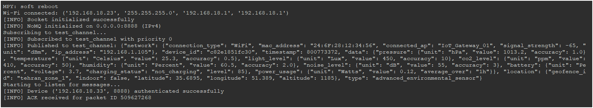
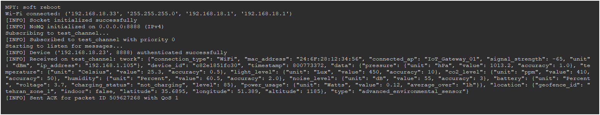
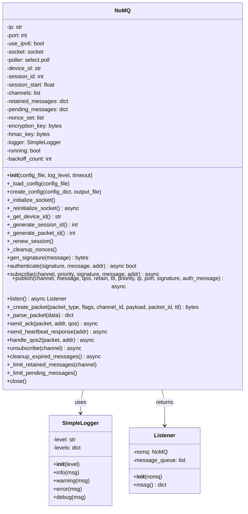

# NoMQ: Lightweight Secure IoT Messaging Protocol 🚀


[](https://opensource.org/licenses/MIT)
[](https://micropython.org/)
[](https://github.com/armanghobadi/nomq/issues)
[](https://github.com/armanghobadi/nomq)

**NoMQ** (No Message Queue) is a lightweight, secure, and scalable messaging protocol designed for Internet of Things (IoT) applications. Built for resource-constrained devices running MicroPython (e.g., ESP32, ESP8266), NoMQ delivers enterprise-grade security, reliable message delivery, and real-time communication without the overhead of traditional message brokers. It’s ideal for industrial IoT, smart homes, and sensor networks.

**NoMQ**: Secure, efficient, and brokerless messaging for IoT, designed for high reliability in industrial environments.

---

## 📜 Table of Contents

- [Introduction](#introduction)
- [System Objectives](#system-objectives)
- [Protocol Structure](#protocol-structure)
- [Features](#features)
- [Installation](#installation)
- [Usage](#usage)
- [Testing](#testing)
- [Deployment in Real-World Scenarios](#deployment-in-real-world-scenarios)
- [UML Diagram](#uml-diagram)
- [License](#license)
- [Contact](#contact)

---

## 🌟 Introduction

NoMQ is a modern IoT messaging protocol that combines the simplicity of CoAP with the reliability of MQTT, tailored for resource-constrained environments. It uses **AES-256-CBC** encryption, **HMAC-SHA256** authentication, and a robust Quality of Service (QoS) model (0–2) to ensure secure, reliable, and efficient communication. NoMQ operates without a central broker, leveraging UDP for low-latency, peer-to-peer messaging, making it perfect for industrial automation, smart homes, and distributed sensor networks.

### Why NoMQ?
- **Lightweight**: Optimized for devices with limited memory and CPU (e.g., <256 KB RAM).
- **Secure**: End-to-end encryption and authentication protect against eavesdropping and tampering.
- **Brokerless**: Eliminates the need for heavy message brokers, reducing latency and infrastructure costs.
- **Reliable**: QoS levels ensure message delivery, even in unstable networks.
- **Scalable**: Supports multiple devices, channels, and prioritized messaging.

---

## 🎯 System Objectives

NoMQ is designed to meet the following goals:

1. **Security**: Ensure data confidentiality, integrity, and authenticity using advanced cryptography.
2. **Reliability**: Provide configurable QoS (0: fire-and-forget, 1: acknowledged, 2: assured delivery).
3. **Efficiency**: Minimize resource usage for MicroPython devices.
4. **Scalability**: Enable communication across multiple devices and channels.
5. **Robustness**: Handle network failures, packet loss, and hardware constraints gracefully.

---

## 📡 Protocol Structure

NoMQ uses a compact, secure packet structure to balance efficiency and security. Each packet consists of four layers: **Control Header**, **Security Header**, **Data Header**, and **Verification**.

### Packet Structure
| Layer            | Field                | Size (Bytes) | Description                                      |
|------------------|----------------------|--------------|--------------------------------------------------|
| **Control**      | Magic Number         | 2            | Fixed value (`0x4E4D`, "NM") for identification |
|                  | Version              | 1            | Protocol version (`0x01`)                       |
|                  | Packet Type          | 1            | Type (e.g., Publish: `0x01`, Subscribe: `0x02`) |
|                  | Flags                | 1            | QoS (0–2), Retain, Priority (0–15)              |
|                  | Packet ID            | 4            | Unique packet identifier                        |
|                  | Session ID           | 4            | Session identifier for persistence              |
|                  | TTL                  | 2            | Time-to-live for message expiration             |
| **Security**     | IV                   | 16           | Initialization Vector for AES-256-CBC           |
|                  | Timestamp            | 4            | Unix timestamp for replay protection            |
| **Data**         | Channel ID           | 16           | SHA256 hash of channel name (truncated)         |
|                  | Payload Length       | 2            | Length of encrypted payload                     |
|                  | Payload              | Variable     | Encrypted data (AES-256-CBC)                    |
| **Verification** | HMAC                 | 32           | HMAC-SHA256 for integrity and authenticity      |

### Packet Types
- `0x01`: Publish (send message to a channel)
- `0x02`: Subscribe (join a channel)
- `0x03`: Ack (acknowledge receipt)
- `0x04`: Unsubscribe (leave a channel)
- `0x05`: Heartbeat (maintain session)
- `0x06–0x08`: QoS 2 handshake (PUBREC, PUBREL, PUBCOMP)

### Flags
- **Bits 0–1**: QoS (0: At most once, 1: At least once, 2: Exactly once)
- **Bit 2**: Retain (store message for new subscribers)
- **Bits 4–7**: Priority (0–15, higher = higher priority)


---

## ✨ Features

- **🔒 Enterprise-Grade Security**:
  - AES-256-CBC encryption for confidentiality.
  - HMAC-SHA256 for integrity and authentication.
  - Replay attack protection using nonces and timestamps.
- **📬 Reliable Messaging**:
  - QoS levels (0–2) for flexible delivery guarantees.
  - Automatic retries with exponential backoff.
  - Retained messages for new subscribers.
- **⚡ Lightweight Design**:
  - Optimized for MicroPython on ESP32/ESP8266.
  - Memory-efficient with configurable limits (e.g., max 50 pending messages).
- **🌐 Scalable Communication**:
  - Supports multiple channels (up to 20) and devices.
  - Broadcast support (e.g., `255.255.255.255`) for network-wide messaging.
- **🔄 Robustness**:
  - Automatic socket reinitialization with backoff.
  - Session renewal and nonce cleanup to prevent memory leaks.
  - Comprehensive error handling for network and payload issues.

---

## 🛠️ Installation

### Prerequisites
- **Hardware**: MicroPython-compatible microcontroller (e.g., ESP32, ESP8266).
- **Software**: MicroPython v1.20 or higher.
- **Modules**: `uhashlib`, `ucryptolib`, `ubinascii`, `uasyncio`, `socket`, `json`, `struct`, `os`.
- **Tools**: `esptool`, `ampy`, `rshell`, or `Thonny` for deployment.

### Steps
1. **Install MicroPython**:
   - Download the latest firmware from [micropython.org](https://micropython.org/download/).
   - Flash the firmware to your device:
     ```bash
     esptool.py --port /dev/ttyUSB0 erase_flash
     esptool.py --port /dev/ttyUSB0 write_flash -z 0x1000 esp32-firmware.bin
     ```

2. **Clone the Repository**:
   ```bash
   git clone https://github.com/armanghobadi/nomq.git
   cd nomq
   ```

3. **Deploy the Code**:
   - Copy `nomq.py` and optionally `test_nomq.py` to your device:
     ```bash
     ampy --port /dev/ttyUSB0 put nomq.py
     ampy --port /dev/ttyUSB0 put test_nomq.py
     ```

4. **Create Configuration**:
   - Generate a `nomq_config.json` file with secure keys:
     ```python
     from nomq import NoMQ
     import ubinascii, os
     config = {
         "ip": "0.0.0.0",
         "port": 8888,
         "use_ipv6": False,
         "encryption_key": ubinascii.hexlify(os.urandom(32)).decode(),
         "hmac_key": ubinascii.hexlify(os.urandom(32)).decode()
     }
     nomq = NoMQ()
     nomq.create_config(config, "nomq_config.json")
     ```

---

## 🚀 Usage

### Example: Publish and Subscribe
Below is an example of using NoMQ to publish and subscribe to a channel, with WiFi setup and JSON message handling.

```python
import uasyncio as asyncio
import network
import json
import time
import ubinascii
from machine import unique_id
from nomq import NoMQ

# WiFi credentials
SSID = "your_wifi_ssid"
PASSWORD = "your_wifi_password"

async def connect_wifi():
    wlan = network.WLAN(network.STA_IF)
    wlan.active(True)
    if not wlan.isconnected():
        print("Connecting to WiFi...")
        wlan.connect(SSID, PASSWORD)
        while not wlan.isconnected():
            await asyncio.sleep(1)
    print("WiFi connected:", wlan.ifconfig())

async def main():
    try:
        await connect_wifi()
        nomq = NoMQ("nomq_config.json", log_level="INFO", timeout=5)
        
        # Generate authentication signature
        signature = nomq.gen_signature("auth")
        
        # Subscribe to a channel
        print("Subscribing to test/channel...")
        await nomq.subscribe("test/channel", priority=0, signature=signature, message="auth")
        
        # Publish a JSON message
        message_json = {
            "device_id": ubinascii.hexlify(unique_id()).decode(),
            "timestamp": int(time.time()),
            "type": "environmental_sensor",
            "data": {
                "temperature": {"value": 25.3, "unit": "Celsius"},
                "humidity": {"value": 60.5, "unit": "Percent"},
                "battery": {"level": 85, "unit": "Percent"}
            },
            "location": {"latitude": 35.6895, "longitude": 51.3890}
        }
        message = json.dumps(message_json)
        
        await nomq.publish(
            "test/channel",
            message,
            qos=2,
            retain=True,
            ip="255.255.255.255",
            port=8888,
            signature=signature,
            auth_message="auth"
        )
        
        # Listen for messages
        print("Listening for messages...")
        listener = await nomq.listen()
        while True:
            msg = listener.mssg()
            if msg:
                try:
                    parsed_msg = json.loads(msg["message"])
                    print(f"Received JSON: {msg['channel']} -> {parsed_msg}")
                except ValueError:
                    print(f"Received non-JSON: {msg['channel']} -> {msg['message']}")
            await asyncio.sleep(0.1)
    
    except Exception as e:
        print(f"Error: {e}")
        raise

try:
    asyncio.run(main())
except KeyboardInterrupt:
    print("Terminated by user")
except Exception as e:
    print(f"Unexpected error: {e}")
```

### Screenshots
- **Sender Device**:  
  
- **Receiver Device**:  
  
- **Unit Test**:  
  

### Key Methods
- `subscribe(channel, priority, signature, message, addr)`: Join a channel with optional authentication.
- `publish(channel, message, qos, retain, ttl, priority, ip, port, signature, auth_message)`: Send a message to a channel.
- `listen()`: Asynchronously receive messages, returning a `Listener` object with a `mssg()` method.
- `unsubscribe(channel)`: Leave a channel.
- `create_config(config_dict, output_file)`: Generate an encrypted configuration file.
- `gen_signature(message)`: Create an HMAC-SHA256 signature for authentication.
- `authenticate(signature, message, addr)`: Verify device authenticity.

---

## 🧪 Testing

NoMQ includes a comprehensive test suite (`test.py`) to validate functionality, security, and performance on MicroPython devices. The suite covers:

- **Unit Tests**: Test internal functions (`gen_signature`, `_create_packet`, `_parse_packet`, etc.).
- **Integration Tests**: Verify subscribe, publish, and listen workflows with QoS 0–2.
- **Security Tests**: Ensure HMAC authentication and replay attack prevention.
- **Performance Tests**: Evaluate high-load scenarios (e.g., 30 messages).

### Running Tests
1. Ensure WiFi connectivity (see `connect_wifi` above).
2. Upload `nomq.py` and `test.py` to your device.
3. Run the test suite:
   ```python
   import test
   asyncio.run(test.main())
   ```
4. Check the output for test results:
   ```
   [INFO] PASS: HMAC-SHA256 signature generation
   [INFO] PASS: Publish and receive message with QoS 1
   [INFO] Test Suite: NoMQ Tests
   [INFO] Passed: 12, Failed: 0
   ```

### Test Notes
- Tests use a broadcast IP (`255.255.255.255`) to ensure message delivery on single-device setups.
- The suite is optimized for MicroPython’s limited exception handling (e.g., no `UnicodeDecodeError`).
- For low-memory devices, reduce the performance test load (e.g., 20 messages).

---

## 🌍 Deployment in Real-World Scenarios

NoMQ is designed for various IoT applications:

1. **Industrial IoT**:
   - Securely connect sensors and controllers in factories.
   - Example: Monitor machine health and send high-priority alerts (QoS 2).
2. **Smart Homes**:
   - Control devices like lights or thermostats with guaranteed delivery.
   - Example: Toggle a relay remotely with authentication.
3. **Sensor Networks**:
   - Collect real-time data from distributed sensors.
   - Example: Aggregate environmental data (temperature, humidity) across a farm.
4. **Prototyping**:
   - Test lightweight protocols in research or academic projects.
   - Example: Simulate a mesh network for IoT communication.

### Deployment Tips
- **Security**: Use unique, randomly generated `encryption_key` and `hmac_key` for each deployment.
- **Network**: Configure a stable WiFi network or dedicated access point. Use NTP for time synchronization:
  ```python
  import ntptime
  ntptime.settime()
  ```
- **Monitoring**: Log messages to a file or external server:
  ```python
  with open("nomq_log.txt", "a") as f:
      f.write(f"[INFO] {msg}\n")
  ```
- **Scalability**: Deploy multiple devices with unique `device_id` values and manage channel priorities.

---

## 📊 UML Diagram

Below is the UML class diagram for the `NoMQ` class, reflecting its structure and methods.




---

## 📄 License

NoMQ is licensed under the [MIT License](LICENSE). See the [LICENSE](LICENSE) file for details.

---

## 📬 Contact

For questions, suggestions, or support, please:
- Open an issue on the [GitHub repository](https://github.com/armanghobadi/nomq).
- Contact the maintainers at [arman.ghobadi.ag@gmail.com](mailto:arman.ghobadi.ag@gmail.com).

---

**NoMQ**: Empowering secure, lightweight, and reliable IoT communication for the future. 🌐