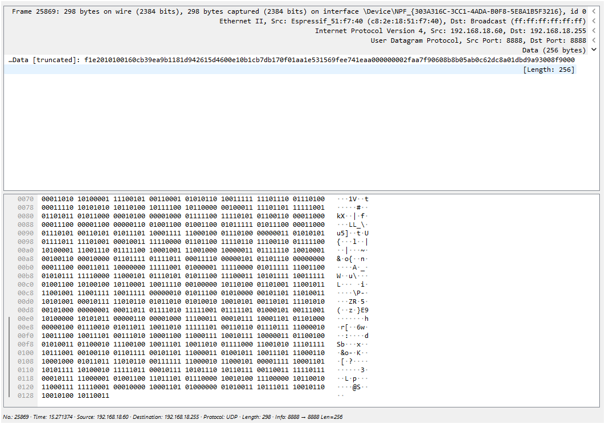
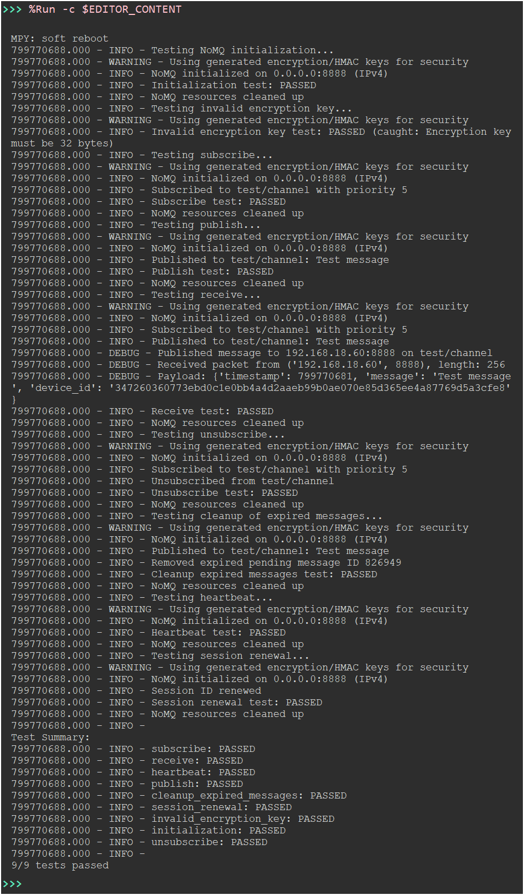
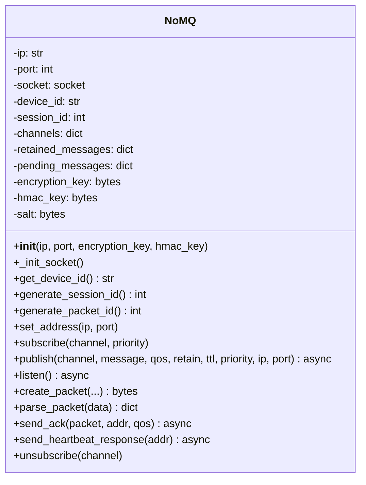

# NoMQ: Lightweight Secure IoT Messaging Protocol 🚀

 


**NoMQ** (No Message Queue) is a lightweight, secure, and scalable messaging protocol designed for Internet of Things (IoT) applications. Built for resource-constrained devices like ESP32 and ESP8266 running MicroPython, NoMQ provides enterprise-grade security, reliable message delivery, and real-time communication without the overhead of traditional message brokers.

---

## 📜 Table of Contents

- [Introduction](#introduction)
- [System Objectives](#system-objectives)
- [Protocol Structure](#protocol-structure)
- [Features](#features)
- [Installation](#installation)
- [Usage](#usage)
- [Deployment in Real-World Scenarios](#deployment-in-real-world-scenarios)
- [UML Diagram](#uml-diagram)
- [License](#license)

---

## 🌟 Introduction

NoMQ is a modern IoT messaging protocol inspired by the simplicity of CoAP and the reliability of MQTT, but tailored for environments where minimal resource usage and maximum security are paramount. It leverages **AES-256-CBC** encryption, **HMAC-SHA256** authentication, and a robust Quality of Service (QoS) model to ensure secure and reliable communication in real-world IoT deployments.

### Why NoMQ?
- **Lightweight**: Optimized for low-memory devices (e.g., ESP32, ESP8266).
- **Secure**: End-to-end encryption and integrity protection.
- **Scalable**: Supports multiple devices and channels with prioritized messaging.
- **Brokerless**: Eliminates the need for heavy message brokers, reducing latency and complexity.
- **Real-World Ready**: Designed for industrial IoT, smart homes, and sensor networks.

---

## 🎯 System Objectives

The primary objectives of NoMQ are to provide a messaging protocol that is:

1. **Secure**: Protect data confidentiality, integrity, and authenticity using state-of-the-art cryptographic techniques.
2. **Reliable**: Ensure message delivery with configurable QoS levels (0–3).
3. **Efficient**: Minimize resource usage (CPU, memory, and network) for constrained devices.
4. **Scalable**: Enable seamless communication in networks with multiple devices and channels.
5. **Flexible**: Support diverse IoT use cases, from smart homes to industrial automation.

---

## 🏗️ Architecture

NoMQ follows a **layered architecture** to separate concerns and ensure modularity. The architecture is designed to balance security, performance, and ease of use.

### Architectural Layers
1. **Control Layer**:
   - Manages packet metadata (e.g., packet type, session ID, TTL).
   - Ensures protocol versioning and session persistence.
2. **Security Layer**:
   - Implements AES-256-CBC encryption for confidentiality.
   - Uses HMAC-SHA256 for integrity and authenticity.
   - Includes timestamps and IVs to prevent replay attacks.
3. **Data Layer**:
   - Handles payload encoding (JSON) and channel identification.
   - Supports variable-length payloads with efficient padding.
4. **Verification Layer**:
   - Validates packet integrity using HMAC-SHA256.
   - Ensures robust error handling for malformed packets.

### System Components
- **NoMQ Class**: Core protocol implementation with methods for subscription, publication, and packet processing.
- **UDP Socket**: Underlying transport layer for low-latency communication.
- **MicroPython Runtime**: Provides the execution environment for resource-constrained devices.
- **Wi-Fi Module**: Manages network connectivity with automatic reconnection logic.

 


## 📡 Protocol Structure

NoMQ uses a well-defined packet structure to ensure efficiency and security. Each packet consists of four main sections: **Control Header**, **Security Header**, **Data Header**, and **Verification**.

### Packet Structure
| Layer            | Field                | Size (Bytes) | Description                                      |
|------------------|----------------------|--------------|--------------------------------------------------|
| **Control**      | Magic Number         | 2            | Fixed value (`0xF1E2`) for packet identification |
|                  | Version              | 1            | Protocol version (`0x01`)                       |
|                  | Packet Type          | 1            | Type (Publish, Subscribe, Ack, Heartbeat, etc.) |
|                  | Flags                | 2            | QoS (0-3), Retain, Priority (0-15)              |
|                  | Packet ID            | 4            | Unique packet identifier                        |
|                  | Session ID           | 8            | Persistent session identifier                   |
|                  | TTL                  | 2            | Time-to-live for message expiration             |
| **Security**     | IV                   | 16           | Initialization Vector for AES-CBC               |
|                  | Timestamp            | 8            | Unix timestamp for replay protection            |
| **Data**         | Channel ID           | 16           | SHA256 hash of channel name                     |
|                  | Payload Length       | 4            | Length of encrypted payload                     |
|                  | Payload              | Variable     | Encrypted JSON data (AES-256-CBC)               |
| **Verification** | HMAC                 | 32           | HMAC-SHA256 for integrity and authenticity      |

### Packet Types
- `0x01`: Publish (send message to a channel)
- `0x02`: Subscribe (join a channel)
- `0x03`: Ack (acknowledge receipt)
- `0x04`: Unsubscribe (leave a channel)
- `0x05`: Heartbeat (keep session alive)

### Flags
- **Bits 0-1**: QoS (0: At most once, 1: At least once, 2: Exactly once, 3: Reserved)
- **Bit 2**: Retain (store message for new subscribers)
- **Bits 4-7**: Priority (0-15, higher value = higher priority)
- **Bits 8-15**: Reserved

---

## ✨ Features

- **🔒 Enterprise-Grade Security**:
  - AES-256-CBC encryption for data confidentiality.
  - HMAC-SHA256 for data integrity and authenticity.
  - Replay attack protection via timestamps and random IVs.
- **📬 Reliable Messaging**:
  - Configurable QoS levels (0–3) for flexible delivery guarantees.
  - Automatic retries with exponential backoff.
  - Persistent sessions with unique session IDs.
- **⚡ Lightweight Design**:
  - Optimized for MicroPython on ESP32/ESP8266.
  - Minimal memory and CPU usage.
- **🌐 Scalable Communication**:
  - Supports multiple devices and channels.
  - Prioritized messaging for critical data.
  - Broadcast support for network-wide communication.
- **🔄 Real-World Robustness**:
  - Automatic Wi-Fi reconnection with exponential backoff.
  - Heartbeat mechanism for session maintenance.
  - Comprehensive error handling for network and hardware failures.

---

## 🛠️ Installation

### Prerequisites
- **Hardware**: ESP32 or ESP8266 microcontroller.
- **Software**: MicroPython v1.20 or higher.
- **Tools**: `ampy`, `rshell`, or `Thonny` for code deployment.

### Steps
1. **Install MicroPython**:
   - Download the latest MicroPython firmware from [micropython.org](https://micropython.org/download/).
   - Flash the firmware to your device using `esptool`:
     ```bash
     esptool.py --port /dev/ttyUSB0 erase_flash
     esptool.py --port /dev/ttyUSB0 write_flash -z 0x1000 esp32-firmware.bin
     ```

2. **Clone the Repository**:
   ```bash
   git clone https://github.com/armanghobadi/nomq.git
   cd nomq
   ```

3. **Deploy the Code**:
   - Copy `nomq.py` to your device using `ampy`:
     ```bash
     ampy --port /dev/ttyUSB0 put nomq.py
     ```

---

## 🚀 Usage

### Example: Publish and Subscribe
```python
import uasyncio as asyncio
from nomq import NoMQ

async def main():
    # Initialize NoMQ
    device = NoMQ()
    
    # Subscribe to a channel
    device.subscribe("device/temperature/r2", priority=1)
    
    # Publish a message
    await device.publish("device/relay", "relay/03/off", qos=2, retain=True, priority=1)
    
    # Start listening for incoming messages
    await device.listen()

# Run the application
asyncio.run(main())
```

 

### Key Methods
- `subscribe(channel, priority)`: Join a channel with specified priority.
- `publish(channel, message, qos, retain, ttl, priority, ip, port)`: Send a message to a channel.
- `listen()`: Asynchronously receive and process incoming messages.
- `unsubscribe(channel)`: Leave a channel.
- `set_address(ip, port)`: Update the listening address.

---

## 🌍 Deployment in Real-World Scenarios

NoMQ is designed for a variety of IoT applications, including:

1. **Industrial IoT**:
   - Secure communication between sensors, actuators, and controllers.
   - Example: Monitor factory equipment and send alerts with high-priority messages.
2. **Smart Homes**:
   - Control devices like relays and lights with guaranteed delivery.
   - Example: Turn off a relay remotely with QoS 2.
3. **Sensor Networks**:
   - Collect data from distributed sensors in real time.
   - Example: Aggregate temperature readings from multiple devices.
4. **Research and Prototyping**:
   - Test lightweight communication protocols in academic projects.
   - Example: Simulate a mesh network with NoMQ.

### Deployment Tips
- **Security**: Replace default encryption and HMAC keys with unique, secure values.
- **Network**: Use a stable Wi-Fi network or configure a dedicated access point.
- **Monitoring**: Log messages to a serial console or external server for debugging.
- **Scalability**: Deploy multiple devices with unique device IDs and session IDs.

---

## 📊 UML Diagram

Below is the UML class diagram for the `NoMQ` class, illustrating its structure and methods.



---

## 📄 License

NoMQ is licensed under the [MIT License](LICENSE). See the LICENSE file for details.

---

## 📬 Contact

For questions, suggestions, or support, please open an issue on the [GitHub repository](https://github.com/armanghobadi/nomq) or contact the maintainers at [arman.ghobadi.ag@gmail.com](mailto:arman.ghobadi.ag@gmail.com).

---

**NoMQ**: Empowering the future of IoT with secure, lightweight, and reliable communication. 🌐